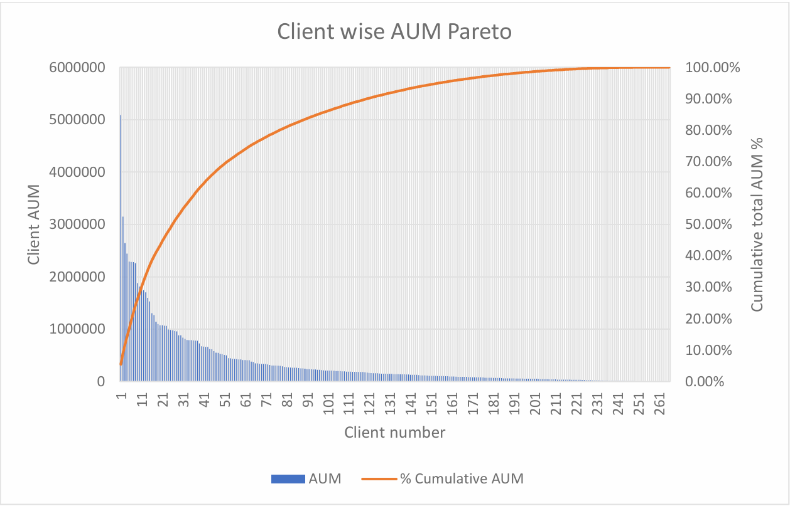
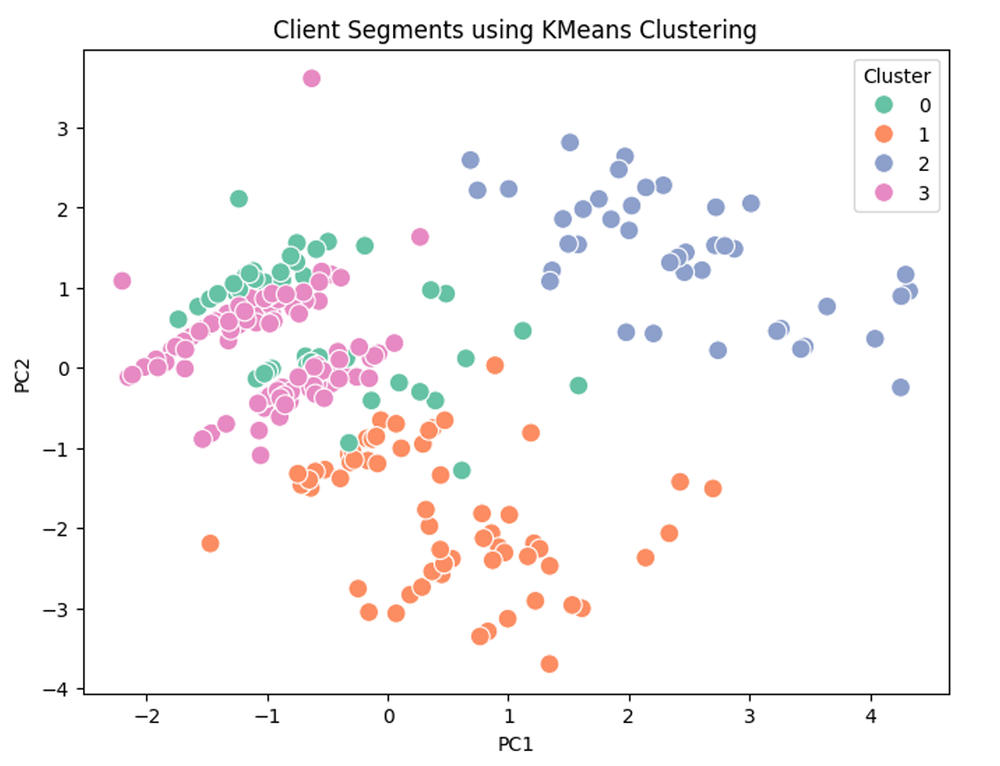
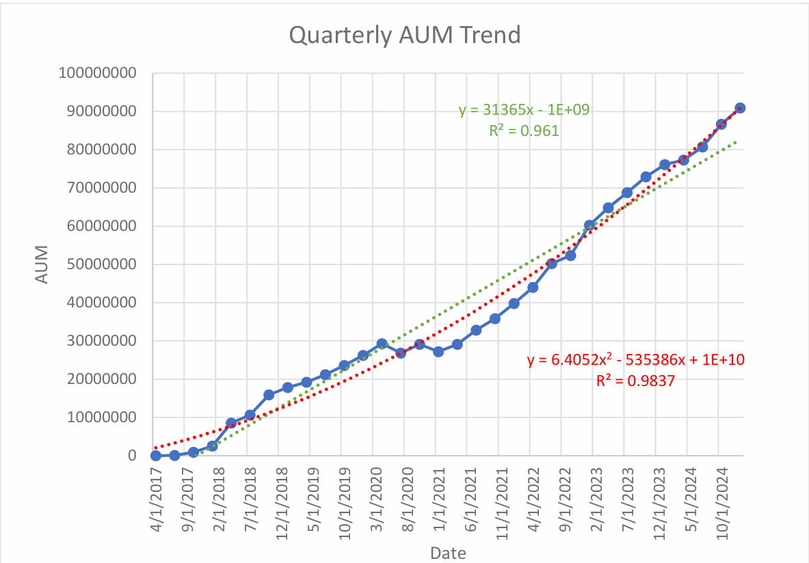
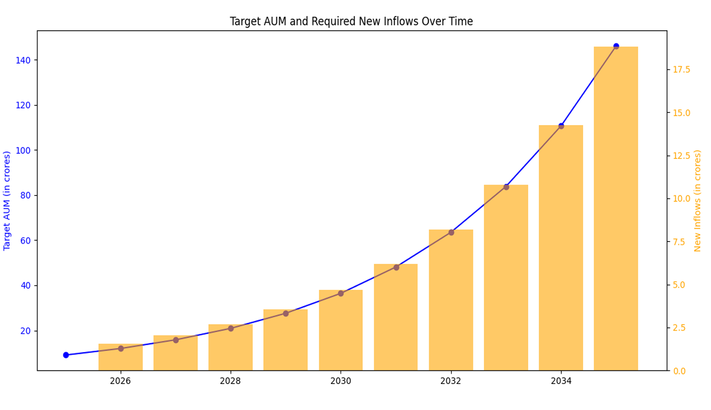

# FinTech Revenue Optimization Analysis

## Overview

This project presents an end-to-end business data analysis case study for a mutual fund advisory. The objective was to analyze client behavior, identify revenue-driving segments, and design data-driven strategies for client acquisition, retention, and long-term growth.

The analysis combines exploratory data analysis, customer segmentation, and time-series forecasting to support structured business decision-making.

## Project Workflow

The project follows a structured business analytics workflow:

1. **Data Understanding & Feature Engineering:**  
   Cleaned and transformed raw client data, engineered meaningful variables such as Monthly AUM to better represent client investment behavior and long-term value.

2. **Exploratory Data Analysis (EDA):**  
   Analyzed client demographics, investment behavior, and distribution patterns to understand key revenue drivers.

3. **Client Value Analysis:**  
   Identified high-value customers using Pareto-based revenue contribution analysis.

4. **Customer Segmentation:**  
   Applied clustering techniques to group clients based on demographic and behavioral attributes.

5. **Business Strategy Design:**  
   Translated analytical insights into actionable acquisition and retention strategies.

6. **AUM Forecasting & Target Planning:**  
   Modeled historical growth trends and estimated client acquisition targets for long-term planning.

## Tools & Technologies

- Python  
- Pandas, NumPy  
- Matplotlib, Seaborn, MS-Excel
- Scikit-learn  
- Jupyter Notebook  

## Dataset

The dataset used in this project represents anonymized client-level and investment-level information from a mutual fund advisory. Sensitive identifiers were removed, and values were slightly modified to preserve confidentiality while maintaining analytical integrity.

## Key Results & Insights

- A small proportion of clients contributed the majority of revenue, highlighting the importance of focused retention strategies.
- Client segmentation revealed distinct investor profiles with different investment behavior, risk appetite, and growth potential.
- Referral-based clients demonstrated stronger investment engagement compared to direct connections.
- AUM growth showed a strong dependency on client acquisition trends over time.
- Forecasting results helped estimate yearly client acquisition targets to sustain long-term growth.

## Visual Highlights

### Pareto Analysis (Client Revenue Contribution)

### Customer Segmentation

### AUM Forecasting Trend

### Targets

## Full Report

For detailed methodology, analysis, and business recommendations, refer to the full project report:

[View Full Report](./final_report.pdf)
